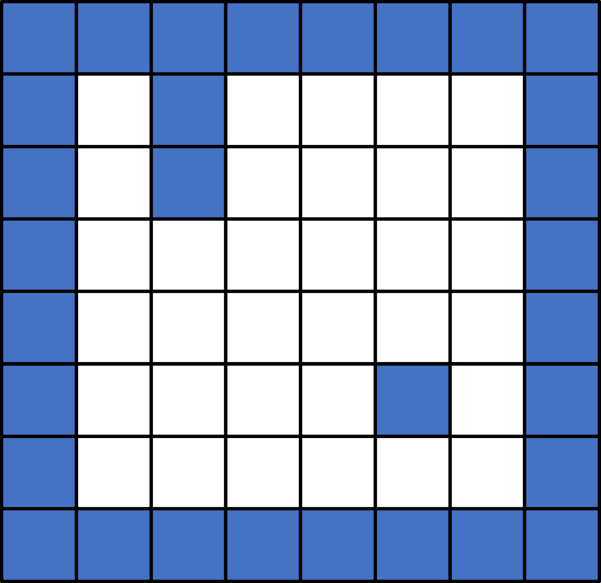
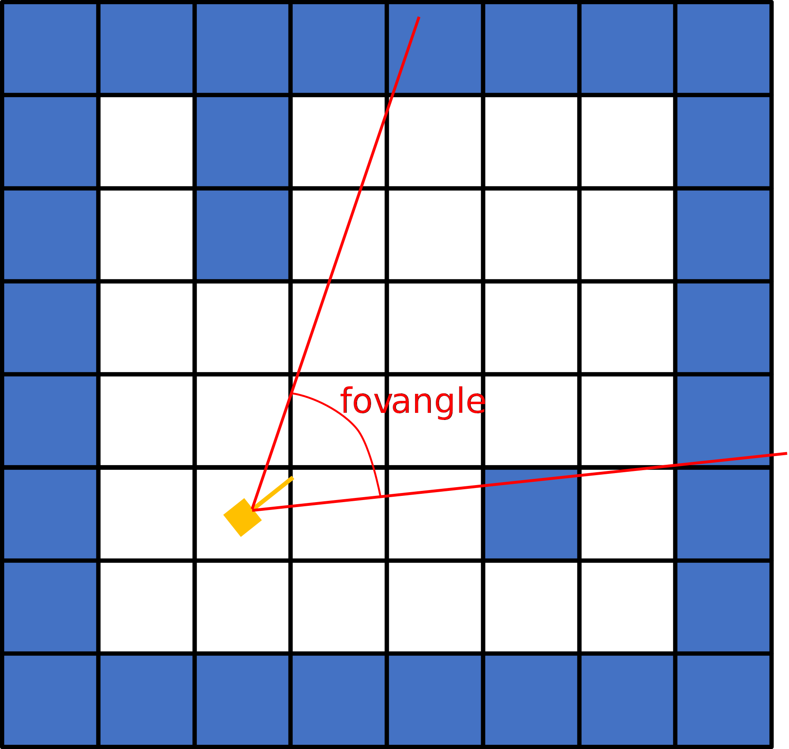
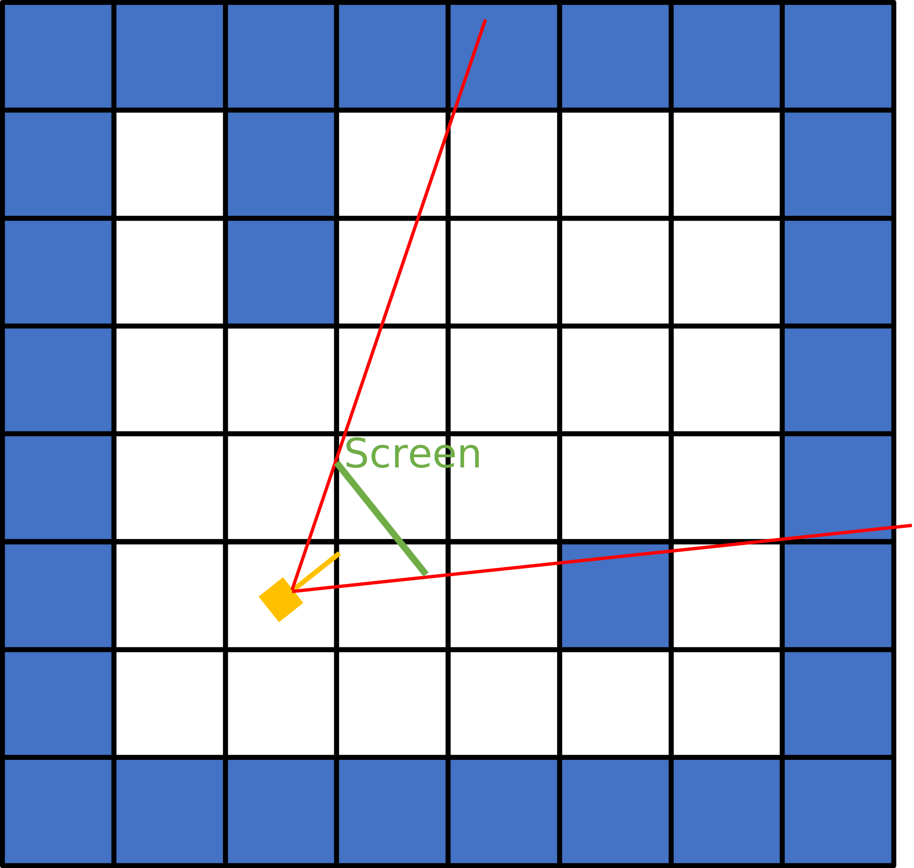
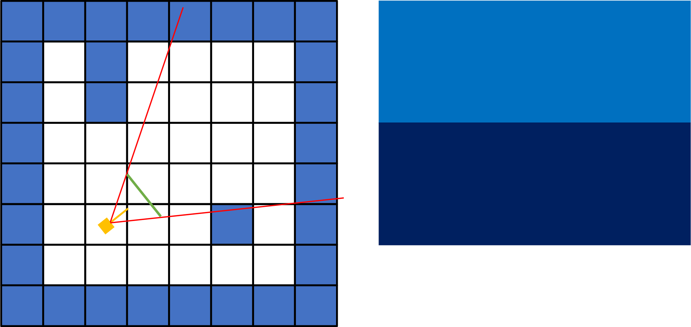
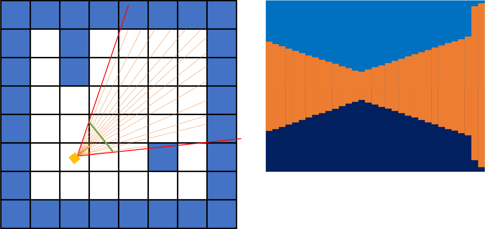
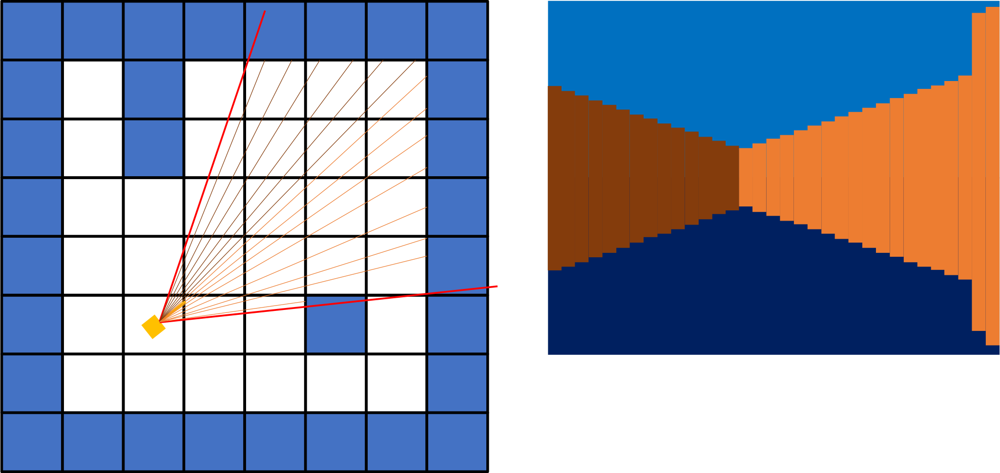

# Basis of Ray Caster Engine

Basic Idea is to render 2D-tiled world in 3D. It requires to know the distance from the point of view 
(usually the player) and object in it field of view.

## World representation

### The map

The example map used in this document will look like:

The blue cells represent walls.

### Player (point of view)

The player is represented by a 2D point with it coordinates and a normalized 2D vector representing the “look at” direction.
We also add a `fov` (Field Of View) parameter as an angle centered on the player's direction.

### Screen

To render the scene we need to draw pixels on the screen. The screen is represented by it width and height (in pixel)

If we try to represent the screen in our 2D map it may look like a plane normal to the player direction.

With this representation, the height of the screen represents the 3D world vertical.

## Rendering

The basic Idea is that the farthest an object is the smallest it has to be drawn.

First, draw background (different color for ground and sky).

Rendering loops for each x of the screen, cast a ray to determine the distance of the object,
then draw a vertical line centered on the middle height of the screen with a length depending on the hit distance.

Finally:

Let's put a different color if we hit a horizontal wall:

Amazing!
